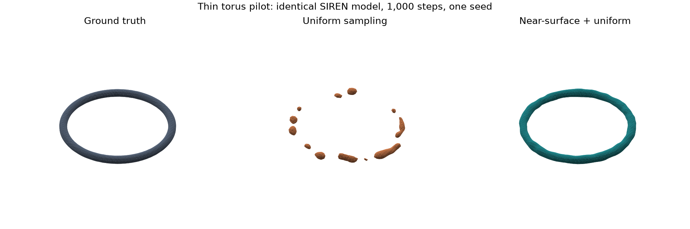

# Pilot: thin torus sampling study

Run on 3 October 2026 using a local RTX 2080 Super (8 GB). Both runs use
SIREN width 64, three hidden layers, 1,000 Adam steps, batch size 2,048,
learning rate 1e-4, training seed 0, evaluation seed 10000, major radius
0.55 and tube radius 0.04. They differ only in training sampling policy.

| Metric | Uniform | Mixed |
|---|---:|---:|
| uniform_sdf_mae | 0.008604 | 0.009776 |
| near_surface_sdf_mae | 0.014646 | 0.003624 |
| surface_abs_predicted_sdf | 0.014259 | 0.002198 |
| interior_probe_retention | 0.312500 | 1.000000 |
| exterior_probe_preservation | 0.953125 | 1.000000 |
| train_seconds | 3.707541 | 4.237915 |

## Observation
The uniform-sampling reconstruction has fragmented thin geometry in this pilot.
Mixed near-surface/uniform sampling retains the ring in the rendered extraction
and performs better on the near-surface and feature-probe diagnostics. It has
slightly higher uniform-domain distance error. This illustrates why aggregate
field error alone may not reflect preservation of small features.

## Interpretation limits
This is an established sampling baseline, not a new method. One shape, one seed,
one training duration and one mesh resolution cannot establish general superiority
or topological correctness. Only 57 of the 32,768 uniform evaluation points lie
inside the thin object, so the reported occupancy IoU is noisy and should not be
used alone. No hypothesis test or uncertainty estimate is claimed. These pilot
samples are development data, not a final untouched test benchmark. More training
could repair the uniform baseline. Training time excludes startup, plotting and
mesh extraction; memory reports CUDA tensors, not total GPU process memory.

## Reproduce

~~~powershell
.\.venv\Scripts\python -m neural_geometry.run --model siren --shape torus --feature 0.04 --sampling uniform --steps 1000 --out runs/pilot-uniform
.\.venv\Scripts\python -m neural_geometry.run --model siren --shape torus --feature 0.04 --sampling mixed --steps 1000 --out runs/pilot-mixed
~~~

Configurations, metrics and logged loss values are preserved in [pilot/](pilot/).
The exact source commit is recorded in each configuration. Floating-point GPU
results and runtimes can vary across environments; exact bitwise reproducibility
is not promised. The next experiment should vary tube thickness and repeat seeds,
including longer uniform training and mesh-resolution checks.
